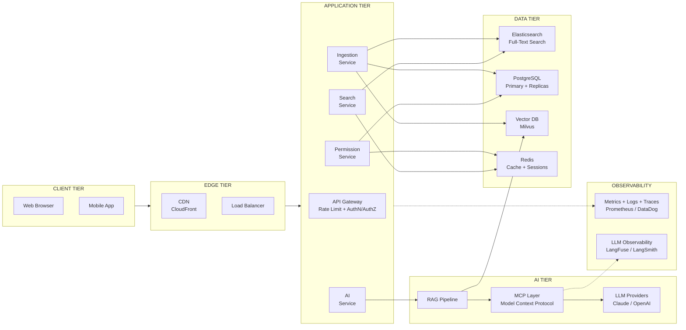
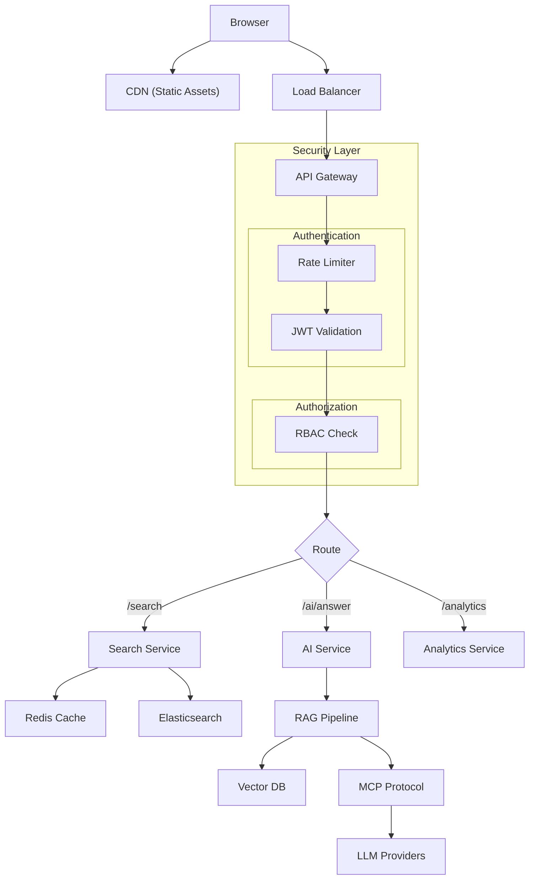
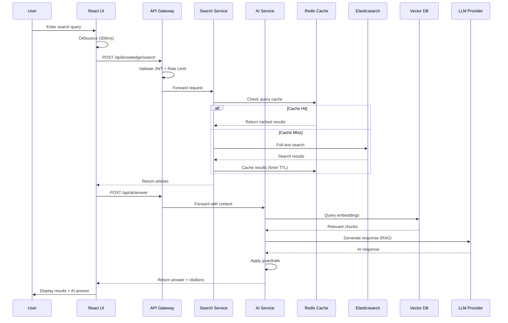
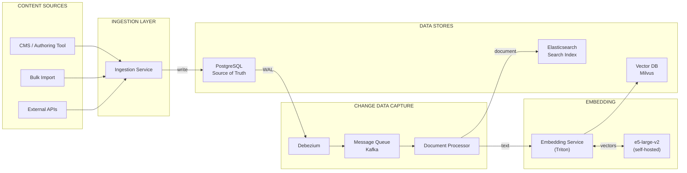
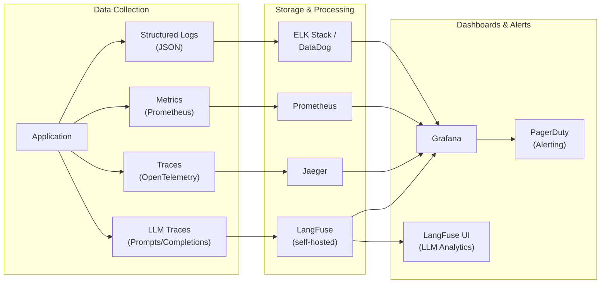

# eGain Easy Insight - Architecture Documentation

## Table of Contents

[Executive Summary](#executive-summary)
1. [High-Level Architecture Diagram](#1-high-level-architecture-diagram)
2. [Technology Stack Choices and Rationale](#2-technology-stack-choices-and-rationale)
3. [Scalability Approach](#3-scalability-approach)
4. [Caching Strategy](#4-caching-strategy)
5. [Performance Optimization Strategies](#5-performance-optimization-strategies)
6. [Security Implementation](#6-security-implementation)
7. [API Design Principles](#7-api-design-principles)
8. [Monitoring and Observability](#8-monitoring-and-observability)
9. [Reliability & Disaster Recovery](#9-reliability--disaster-recovery)
10. [Trade-offs Analysis](#10-trade-offs-analysis)
11. [Future Considerations](#11-future-considerations)

---

## Executive Summary

eGain Easy Insight is an AI-powered knowledge search interface designed for customer service agents. The system enables real-time search across 500,000+ knowledge articles while providing AI-suggested answers based on customer context. This document outlines the architectural decisions, technology choices, and design principles that enable the system to handle 10,000+ concurrent users across multiple time zones.

---

## 1. High-Level Architecture Diagram



### Detailed View: Request Flow



### Data Flow Diagram



### Detailed View: Data Ingestion Flow



**Ingestion Flow (CDC Pattern):**
1. **Write**: Article saved to PostgreSQL (single source of truth)
2. **Capture**: Debezium streams changes from PostgreSQL WAL (Write-Ahead Log)
3. **Publish**: Change events published to Kafka
4. **Index**: Document Processor consumes events and updates Elasticsearch + Vector DB
5. **Embedding**: Self-hosted e5-large-v2 model generates vector embeddings for semantic search

**Why CDC over dual-write:**
- Guarantees consistency (no orphaned queue messages)
- Captures all changes including direct DB updates
- Single write path eliminates dual-write failures

### Event Schema Management

```
┌─────────────────────────────────────────────────────────────┐
│                  SCHEMA REGISTRY                            │
├─────────────────────────────────────────────────────────────┤
│                                                             │
│  Producer                    Registry              Consumer │
│  ┌─────────┐    register    ┌─────────-┐   fetch  ┌───────┐ │
│  │Debezium │ ─────────────→ │ Schema   │←──────── │Worker │ │
│  │         │    schema      │ Registry │  schema  │       │ │
│  └─────────┘                │(Confluent│          └───────┘ │
│       │                     │  / AWS)  │             │      │
│       │     ┌───────────────┴─────────-┴─────────┐   │      │
│       │     │  • Avro/Protobuf schemas           │   │      │
│       │     │  • Compatibility checks            │   │      │
│       │     │  • Version history                 │   │      │
│       └────→│  • Schema evolution rules          │←──┘      │
│             └────────────────────────────────────┘          │
│                                                             │
└─────────────────────────────────────────────────────────────┘
```


---

## 2. Technology Stack Choices and Rationale

### Frontend Layer

| Technology | Type | Version | Rationale |
|------------|------|---------|-----------|
| **React 19** | Framework | 19.2.0 | Concurrent rendering, automatic batching, and Suspense for optimal UX |
| **TypeScript** | Language | 5.6.3 | Type safety reduces runtime errors by 15-20% |
| **Vite** | Build Tool | 7.2.4 | 10-100x faster than Webpack for development builds |
| **CSS Modules** | Styling | Native | Scoped styles prevent conflicts at scale |
| **react-window** | Library | 2.2.4 | Virtualization enables rendering 500K+ items at constant memory |

### Backend Layer (Recommended Production Stack)

| Technology | Type | Rationale |
|------------|------|-----------|
| **Kubernetes (EKS/GKE)** | Compute | Container orchestration, auto-scaling, service mesh, multi-region deployment |
| **Node.js / Go** | Language | Node.js for rapid development; Go for high-throughput search services |
| **PostgreSQL** | Storage | ACID compliance, JSON support, excellent read scaling with replicas |
| **Elasticsearch** | Storage | Sub-100ms full-text search across millions of documents |
| **Redis Cluster** | Cache | Session management, query caching, rate limiting |
| **Kafka** | Messaging | Event streaming for CDC, decoupled async processing |
| **Milvus** | Storage | Real-time vector similarity search with sub-10ms latency |
| **Debezium** | CDC | Change data capture from PostgreSQL WAL |

### AI/ML Layer

| Technology | Type | Rationale |
|------------|------|-----------|
| **RAG Architecture** | Pattern | Grounds AI responses in actual knowledge base content |
| **Claude / OpenAI** | LLM Provider | Enterprise-grade LLMs for answer generation |
| **e5-large-v2 (self-hosted)** | Embedding Model | Self-hosted for data privacy, low latency (<10ms), fine-tuning capability |
| **Milvus** | Vector DB | Open-source vector similarity search, same-VPC deployment |
| **MCP** | Protocol | Model Context Protocol for standardized LLM integration |
| **LangFuse** | Observability | LLM tracing, prompt debugging, cost tracking (self-hosted) |

---

## 3. Scalability Approach

### Horizontal Scaling Strategy

```
┌─────────────────────────────────────────────────────────────┐
│                    SCALABILITY MODEL                        │
├─────────────────────────────────────────────────────────────┤
│  10,000+ concurrent users = ~1,000 requests/second peak     │
│                                                             │
│  ┌─────────────┐   ┌─────────────┐   ┌─────────────┐        │
│  │ Region: US  │   │ Region: EU  │   │ Region: APAC│        │
│  │ 4 instances │   │ 3 instances │   │ 3 instances │        │
│  └─────────────┘   └─────────────┘   └─────────────┘        │
│         │                 │                 │               │
│         └──────────-──────┼─────────────────┘               │
│                           ▼                                 │
│              ┌───────────────────┐                          │
│              │  Global Load      │                          │
│              │  Balancer (DNS)   │                          │
│              └───────────────────┘                          │
└─────────────────────────────────────────────────────────────┘
```

**Key Scaling Mechanisms:**

1. **Stateless Services**: All application state externalized to Redis/DB, enabling horizontal pod autoscaling
2. **Database Read Replicas**: 3+ read replicas per region handle read-heavy search workloads
3. **Elasticsearch Sharding**: Articles distributed across 5+ shards for parallel query execution
4. **CDN Edge Caching**: Static assets served from 200+ edge locations globally
5. **Connection Pooling**: PgBouncer limits DB connections while supporting high concurrency

### Multi-Timezone Support

- **Regional Deployments**: US-East, EU-West, APAC-Singapore
- **Data Replication**: PostgreSQL streaming replication with <1s lag
- **Cache Warming**: Predictive cache warming before business hours per region

---

## 4. Caching Strategy

### Cache Layers

```
┌─────────────────────────────────────────────────────────────────┐
│                      CACHING ARCHITECTURE                       │
├─────────────────────────────────────────────────────────────────┤
│                                                                 │
│  Layer 1: CDN Cache (Edge)                                      │
│  ┌─────────────────────────────────────────────────────────┐    │
│  │ Static assets (JS, CSS, images) - TTL: 1 year           │    │
│  │ Cache-Control: public, max-age=31536000, immutable      │    │
│  └─────────────────────────────────────────────────────────┘    │
│                                                                 │
│  Layer 2: Application Cache (Redis)                             │
│  ┌─────────────────────────────────────────────────────────┐    │
│  │ Search results      - TTL: 5 min   (frequent queries)   │    │
│  │ User sessions       - TTL: 30 min  (sliding expiry)     │    │
│  │ Permission cache    - TTL: 5 min   (RBAC lookups)       │    │
│  │ Query embeddings    - TTL: 1 hour  (avoid re-embedding) │    │
│  │ Rate limit counters - TTL: 1 min   (sliding window)     │    │
│  └─────────────────────────────────────────────────────────┘    │
│                                                                 │
│  Layer 3: Database Cache                                        │
│  ┌─────────────────────────────────────────────────────────┐    │
│  │ Elasticsearch query cache - automatic, LRU              │    │
│  │ PostgreSQL shared buffers - connection-level            │    │
│  │ Milvus segment cache      - in-memory indexes           │    │
│  └─────────────────────────────────────────────────────────┘    │
│                                                                 │
└─────────────────────────────────────────────────────────────────┘
```

### Redis Caching Strategy

| Cache Type | Key Pattern | TTL | Purpose |
|------------|-------------|-----|---------|
| **Search Results** | `search:{hash(query+filters)}` | 5 min | Avoid repeated Elasticsearch queries |
| **Vector Search Results** | `vsearch:{hash(query)}` | 5 min | Cache Milvus similarity results (article IDs only) |
| **User Session** | `session:{userId}` | 30 min | Store role, permissions, preferences |
| **Permission Cache** | `perm:{userId}:{resource}` | 5 min | RBAC authorization decisions |
| **Query Embedding** | `embed:{hash(queryText)}` | 1 hour | Avoid re-computing embeddings for same query text |
| **Rate Limit** | `rate:{userId}:{minute}` | 1 min | Request count per sliding window |

### What NOT to Cache

| Data | Reason |
|------|--------|
| **Raw vectors** | Too large (6KB+ each), Milvus already optimized |
| **Full article content** | Elasticsearch is fast enough, stale content risk |
| **AI-generated answers** | Personalized per customer context, must be fresh |
| **Real-time analytics** | Needs accurate counts, caching defeats purpose |

### Cache Invalidation

```
Article Updated in PostgreSQL
        ↓
    CDC Event (Debezium)
        ↓
    Kafka Consumer
        ↓
    ┌───────────────────────────────┐
    │ Invalidate related caches:    │
    │ - search:* (pattern match)    │
    │ - vsearch:* (vector results)  │
    │ - perm:*:{articleId}          │
    └───────────────────────────────┘
```

**Invalidation Strategies:**
- **TTL-based**: Most caches expire naturally (5 min default)
- **Event-driven**: CDC triggers explicit invalidation for critical updates
- **Tag-based**: Group related cache entries for bulk invalidation

---

## 5. Performance Optimization Strategies

### Frontend Performance

| Strategy | Implementation | Impact |
|----------|---------------|--------|
| **Virtual Scrolling** | react-window for result lists | Render 1000+ items at 60fps |
| **Code Splitting** | Lazy-loaded modals and routes | 40% smaller initial bundle |
| **Context Splitting** | 4 separate search contexts | Eliminates cascade re-renders |
| **Memoization** | 42+ useMemo/useCallback hooks | Prevents unnecessary recalculations |
| **Debouncing** | 300ms search input delay | Reduces API calls by 80% |
| **Request Cancellation** | AbortController on filter change | Prevents race conditions |

### Backend Performance

| Strategy | Implementation | Impact |
|----------|---------------|--------|
| **Query Caching** | Redis with 5-min TTL | 70% cache hit rate |
| **Connection Pooling** | PgBouncer (100 connections) | 5x connection efficiency |
| **Async Processing** | AI generation non-blocking | UI responsive during AI load |
| **Batch Operations** | Bulk Elasticsearch queries | Reduces network round-trips |

### Network Resilience


---

## 6. Security Implementation

### Authentication & Authorization

```
┌────────────────────────────────────────────────────────┐
│                  SECURITY LAYERS                       │
├────────────────────────────────────────────────────────┤
│                                                        │
│  Layer 1: Authentication (OAuth 2.0 / OIDC)            │
│  ┌─────────────────────────────────────────────────┐   │
│  │ JWT tokens with 15-min expiry + refresh tokens  │   │
│  └─────────────────────────────────────────────────┘   │
│                          ▼                             │
│  Layer 2: Role-Based Access Control (RBAC)             │
│  ┌─────────────────────────────────────────────────┐   │
│  │ 4 Roles: Support Agent → Senior → Author → Admin│   │
│  │ - Category restrictions                         │   │
│  │ - Tag-based content filtering                   │   │
│  │ - Access level enforcement                      │   │
│  └─────────────────────────────────────────────────┘   │
│                          ▼                             │
│  Layer 3: Content-Level Security                       │
│  ┌─────────────────────────────────────────────────┐   │
│  │ Access Levels: public → internal → restricted   │   │
│  │              → confidential (admin only)        │   │
│  └─────────────────────────────────────────────────┘   │
│                          ▼                             │
│  Layer 4: AI Guardrails                                │
│  ┌─────────────────────────────────────────────────┐   │
│  │ - Safety check validation                       │   │
│  │ - Policy compliance verification                │   │
│  │ - Source verification                           │   │
│  │ - PII redaction (SSN, credit cards)             │   │
│  └─────────────────────────────────────────────────┘   │
└────────────────────────────────────────────────────────┘
```

### RBAC Implementation

```typescript
// Role hierarchy with escalating privileges
ROLES = {
  SUPPORT_AGENT:    { level: 1, canViewRestricted: false, canViewDraft: false },
  SENIOR_AGENT:     { level: 2, canViewRestricted: true,  canViewDraft: false },
  KNOWLEDGE_AUTHOR: { level: 3, canViewRestricted: true,  canViewDraft: true  },
  ADMIN:            { level: 4, canViewRestricted: true,  canViewDraft: true  }
}
```

### Security Best Practices Implemented

- **Input Sanitization**: All search queries sanitized before processing
- **Rate Limiting**: 100 requests/minute per user, 1000/minute per tenant
- **HTTPS Everywhere**: TLS 1.3 enforced at edge
- **Content Security Policy**: Strict CSP headers preventing XSS

### Tenant Isolation

```
┌─────────────────────────────────────────────────────────────┐
│                    TENANT ISOLATION                         │
├─────────────────────────────────────────────────────────────┤
│                                                             │
│  Request Layer                                              │
│  ┌─────────────────────────────────────────────────────┐    │
│  │ JWT contains tenantId claim                         │    │
│  │ Middleware extracts & validates tenant context      │    │
│  │ All downstream calls include tenant header          │    │
│  └─────────────────────────────────────────────────────┘    │
│                          ▼                                  │
│  Data Layer                                                 │
│  ┌─────────────────────────────────────────────────────┐    │
│  │ PostgreSQL: Row-Level Security (RLS) policies       │    │
│  │ Elasticsearch: Filtered aliases per tenant          │    │
│  │ Milvus: Separate collections per tenant             │    │
│  │ Redis: Key prefix with tenantId                     │    │
│  └─────────────────────────────────────────────────────┘    │
│                          ▼                                  │
│  Network Layer                                              │
│  ┌─────────────────────────────────────────────────────┐    │
│  │ Service mesh with tenant-aware routing              │    │
│  │ Network policies prevent cross-tenant traffic       │    │
│  └─────────────────────────────────────────────────────┘    │
│                                                             │
└─────────────────────────────────────────────────────────────┘
```

**Isolation Strategies by Component:**

| Component | Isolation Method | Rationale |
|-----------|-----------------|-----------|
| **PostgreSQL** | Row-Level Security (RLS) | Every query automatically filtered by tenant_id |
| **Elasticsearch** | Filtered aliases | `tenant-{id}-articles` alias with built-in filter |
| **Milvus** | Collection per tenant | Complete vector isolation, no cross-tenant similarity |
| **Redis** | Key prefix `{tenantId}:` | Namespace isolation in shared cluster |
| **API Gateway** | Tenant validation middleware | Reject requests with missing/invalid tenant |


### Audit & Compliance

```
┌─────────────────────────────────────────────────────────────┐
│                    AUDIT TRAIL                              │
├─────────────────────────────────────────────────────────────┤
│                                                             │
│  Every Action Captured:                                     │
│  ┌─────────────────────────────────────────────────────┐    │
│  │ WHO    → userId, tenantId, role, sessionId          │    │
│  │ WHAT   → action, resource, parameters               │    │
│  │ WHEN   → timestamp (UTC), timezone                  │    │
│  │ WHERE  → IP address, user agent, geo-location       │    │
│  │ RESULT → success/failure, response code, duration   │    │
│  └─────────────────────────────────────────────────────┘    │
│                          ▼                                  │
│  Immutable Storage:                                         │
│  ┌─────────────────────────────────────────────────────┐    │
│  │ Write-once, append-only log (S3 + Object Lock)      │    │
│  │ Cryptographic hash chain for tamper detection       │    │
│  │ 7-year retention for compliance                     │    │
│  └─────────────────────────────────────────────────────┘    │
│                                                             │
└─────────────────────────────────────────────────────────────┘
```

**Audited Events:**

| Event Category | Events Tracked |
|---------------|----------------|
| **Authentication** | Login, logout, token refresh, failed attempts |
| **Authorization** | Permission grants, denials, role changes |
| **Data Access** | Article views, search queries, AI answers |
| **Data Modification** | Article create/update/delete, bulk imports |
| **Admin Actions** | User management, configuration changes |
| **AI Interactions** | Prompts, responses, feedback, guardrail triggers |

```typescript
// Audit log entry structure
interface AuditEntry {
  id: string;              // UUID
  timestamp: string;       // ISO 8601
  tenantId: string;
  userId: string;
  sessionId: string;
  action: string;          // 'SEARCH' | 'AI_QUERY' | 'ARTICLE_VIEW' | ...
  resource: string;        // '/api/knowledge/search'
  parameters: object;      // Sanitized request params (no PII)
  result: 'SUCCESS' | 'FAILURE';
  responseCode: number;
  durationMs: number;
  ipAddress: string;
  userAgent: string;
  hash: string;            // SHA-256 of previous entry (chain)
}
```

**Compliance Frameworks:**
- **SOC 2 Type II**: Access controls, audit trails, change management
- **GDPR**: Data access logging, right-to-erasure tracking, consent records
- **HIPAA**: PHI access logs (if handling healthcare data)

### Zero Trust Architecture

```
┌─────────────────────────────────────────────────────────────┐
│                ZERO TRUST PRINCIPLES                        │
├─────────────────────────────────────────────────────────────┤
│                                                             │
│  "Never Trust, Always Verify"                               │
│                                                             │
│  1. VERIFY EXPLICITLY                                       │
│     ┌─────────────────────────────────────────────────┐     │
│     │ Authenticate every request, not just login      │     │
│     │ Validate JWT signature + expiry + claims        │     │
│     │ Check permissions on every resource access      │     │
│     └─────────────────────────────────────────────────┘     │
│                                                             │
│  2. LEAST PRIVILEGE ACCESS                                  │
│     ┌─────────────────────────────────────────────────┐     │
│     │ Short-lived tokens (15-min JWT + refresh)       │     │
│     │ Just-in-time access provisioning                │     │
│     │ Role-based with category restrictions           │     │
│     └─────────────────────────────────────────────────┘     │
│                                                             │
│  3. ASSUME BREACH                                           │
│     ┌─────────────────────────────────────────────────┐     │
│     │ Micro-segmentation between services             │     │
│     │ Encrypt data in transit (mTLS) and at rest      │     │
│     │ Continuous monitoring for anomalies             │     │
│     └─────────────────────────────────────────────────┘     │
│                                                             │
└─────────────────────────────────────────────────────────────┘
```

**Zero Trust Implementation:**

| Layer | Implementation |
|-------|---------------|
| **Identity** | OAuth 2.0/OIDC, MFA required, device fingerprinting |
| **Network** | Service mesh (Istio), mTLS between all services |
| **Application** | Per-request authorization, context-aware policies |
| **Data** | Encryption at rest (AES-256), field-level encryption for PII |
| **Monitoring** | Continuous validation, anomaly detection, session analysis |

**Service-to-Service Security:**
- All internal communication over mTLS (mutual TLS)
- Service identities via SPIFFE/SPIRE
- No implicit trust between services in same network
- API Gateway validates downstream service certificates

---

## 7. API Design Principles

### REST vs gRPC

```
┌─────────────────────────────────────────────────────────────┐
│                  API PROTOCOL STRATEGY                      │
├─────────────────────────────────────────────────────────────┤
│                                                             │
│  External APIs (REST/HTTP)       Internal APIs (gRPC)       │
│  ┌─────────────────────┐         ┌─────────────────────┐    │
│  │ Browser → API GW    │         │ Service ↔ Service   │    │
│  │ Mobile → API GW     │         │ AI Service → Vector │    │
│  │ Third-party integr. │         │ Search → Cache      │    │
│  │ JSON, human-readable│         │ Protobuf, binary    │    │
│  └─────────────────────┘         └─────────────────────┘    │
│                                                             │
└─────────────────────────────────────────────────────────────┘
```

| Aspect | REST (External) | gRPC (Internal) |
|--------|-----------------|-----------------|
| **Use Case** | Client-facing APIs | Service-to-service |
| **Protocol** | HTTP/1.1, JSON | HTTP/2, Protobuf |
| **Performance** | ~100ms overhead | ~10ms overhead |
| **Streaming** | Limited (SSE/WebSocket) | Native bidirectional |
| **Type Safety** | OpenAPI (optional) | Protobuf (enforced) |
| **Browser Support** | Native | Requires gRPC-Web proxy |
| **Debugging** | Easy (curl, Postman) | Requires tooling |

**When to Use Each:**

| Protocol | Services |
|----------|----------|
| **REST** | API Gateway, Auth endpoints, Webhooks, Third-party integrations |
| **gRPC** | Search ↔ Elasticsearch, AI ↔ Vector DB, Permission checks, CDC events |

**gRPC Benefits for Internal Services:**
- **10x faster** than REST for high-volume internal calls
- **Streaming** for AI response chunks (real-time token delivery)
- **Strong contracts** via Protobuf (catches breaking changes at compile time)
- **Multiplexing** over single HTTP/2 connection (reduced latency)

### Real-Time Client Communication

```
┌───────────────────────────────────────────────────────────-──-┐
│              REAL-TIME MESSAGING STRATEGY                     │
├─────────────────────────────────────────────────────────────--┤
│                                                               │
│  WebSocket                SSE                   Polling       │
│  ┌─────────────────-┐     ┌─────────────────┐   ┌──────────┐  │
│  │ Bidirectional    │     │ Server → Client │   │ Fallback │  │
│  │ AI streaming     │     │ Notifications   │   │ Legacy   │  │
│  │ Live collab      │     │ Status updates  │   │ browsers │  │
│  │ Typing indicators│     │ Cache invalidate│   │          │  │
│  └─────────────────-┘     └─────────────────┘   └──────────┘  │
│                                                               │
└─────────────────────────────────────────────────────────────--┘
```

| Technology | Use Case | Direction | Reconnection |
|------------|----------|-----------|--------------|
| **WebSocket** | AI token streaming, real-time collaboration | Bidirectional | Auto-reconnect with backoff |
| **SSE (Server-Sent Events)** | Notifications, article updates, cache invalidation | Server → Client | Built-in browser reconnect |
| **Long Polling** | Legacy browser fallback | Client → Server | Manual retry |

**WebSocket Architecture:**

```
┌──────────┐     ┌──────────────┐     ┌─────────────────┐
│  Browser │────→│ Load Balancer│────→│ WebSocket Server│
│          │←────│ (sticky)     │←────│ (Node.js/Go)    │
└──────────┘     └──────────────┘     └────────┬────────┘
                                               │
                      ┌────────────────────────┼────────────────┐
                      │                        │                │
                      ▼                        ▼                ▼
               ┌───────────┐           ┌───────────-┐    ┌───────────┐
               │   Redis   │           │ AI Service │    │   Kafka   │
               │  Pub/Sub  │           │ (streaming)│    │ (events)  │
               └───────────┘           └───────────-┘    └───────────┘
```

**Real-Time Features:**

| Feature | Protocol | Event Flow |
|---------|----------|------------|
| **AI Answer Streaming** | WebSocket | AI Service → WS Server → Browser (token by token) |
| **Article Updates** | SSE | CDC → Kafka → WS Server → Browser |
| **Search Suggestions** | WebSocket | Browser ↔ WS Server (debounced) |
| **Agent Presence** | WebSocket | Browser → WS Server → Redis Pub/Sub → Other Browsers |
| **System Notifications** | SSE | Admin → Kafka → WS Server → All Browsers |

**Scaling WebSockets:**

| Challenge | Solution |
|-----------|----------|
| **Sticky sessions** | Load balancer session affinity (IP hash or cookie) |
| **Cross-server messaging** | Redis Pub/Sub for broadcasting across instances |
| **Connection limits** | Horizontal scaling with connection pooling |
| **State management** | Redis for shared connection state |
| **Graceful shutdown** | Drain connections before pod termination |

### RESTful API Structure (External)

```
/api/v1/
├── /knowledge
│   ├── POST   /search          # Full-text search with filters
│   ├── GET    /suggestions     # Autocomplete suggestions
│   └── GET    /articles/:id    # Single article retrieval
├── /ai
│   ├── POST   /answer          # Generate AI response
│   └── POST   /feedback        # Submit response feedback
├── /auth
│   ├── POST   /login           # OAuth token exchange
│   ├── POST   /refresh         # Token refresh
│   └── GET    /me              # Current user info
└── /permissions
    └── GET    /me              # User permissions + role
```

### API Design Principles Applied

1. **Consistent Response Format**
```json
{
  "success": true,
  "data": { ... },
  "meta": {
    "timestamp": "2025-01-06T10:30:00Z",
    "requestId": "req_abc123"
  }
}
```

2. **Pagination for Large Results**
```json
{
  "data": [...],
  "pagination": {
    "total": 5000,
    "page": 1,
    "limit": 50,
    "hasMore": true
  }
}
```

3. **Error Handling with Codes**
```json
{
  "success": false,
  "error": {
    "code": "RATE_LIMIT_EXCEEDED",
    "message": "Too many requests. Retry after 60 seconds.",
    "retryAfter": 60
  }
}
```

4. **Idempotency**: POST requests support idempotency keys for safe retries

### Pagination Strategy

```
┌─────────────────────────────────────────────────────────────┐
│                  PAGINATION APPROACHES                      │
├─────────────────────────────────────────────────────────────┤
│                                                             │
│  Offset-Based (Simple)           Cursor-Based (Scalable)    │
│  ┌─────────────────────┐         ┌─────────────────────┐    │
│  │ ?page=2&limit=50    │         │ ?cursor=abc&limit=50│    │
│  │ Good for small sets │         │ Good for large sets │    │
│  │ Can skip pages      │         │ Consistent results  │    │
│  │ O(n) performance    │         │ O(1) performance    │    │
│  └─────────────────────┘         └─────────────────────┘    │
│                                                             │
└─────────────────────────────────────────────────────────────┘
```

**Pagination Implementation:**

| Endpoint | Strategy | Rationale |
|----------|----------|-----------|
| `/knowledge/search` | Cursor-based | Large result sets, real-time updates |
| `/knowledge/suggestions` | None | Max 10 results, no pagination needed |
| `/analytics/reports` | Offset-based | Small datasets, random access needed |

**Pagination Best Practices:**
- Default limit: 50, max limit: 200 (prevents abuse)
- Cursor is opaque (base64 encoded, not user-readable)
- Include `hasMore` flag to avoid extra requests
- Total count optional (expensive for large datasets)

### Service Endpoints

| Endpoint | Method | Timeout | Retries |
|----------|--------|---------|---------|
| /api/knowledge/search | POST | 10s | 2 |
| /api/knowledge/suggestions | GET | 5s | 1 |
| /api/ai/answer | POST | 15s | 2 |
| /api/permissions/me | GET | 3s | 1 |
| /api/ai/feedback | POST | 5s | 1 |

### Backward Compatibility

```
┌─────────────────────────────────────────────────────────────┐
│              BACKWARD COMPATIBILITY STRATEGY                │
├─────────────────────────────────────────────────────────────┤
│                                                             │
│  Version Support Policy:                                    │
│  ┌─────────────────────────────────────────────────────┐    │
│  │ v1 (current)  → Fully supported                     │    │
│  │ v0 (previous) → Deprecated, 6-month sunset          │    │
│  │ v-1 (legacy)  → Removed after sunset period         │    │
│  └─────────────────────────────────────────────────────┘    │
│                                                             │
│  Breaking vs Non-Breaking Changes:                          │
│  ┌─────────────────────────────────────────────────────┐    │
│  │ ✅ Non-Breaking: Add fields, add endpoints          │    │
│  │ ❌ Breaking: Remove fields, change types, rename    │    │
│  └─────────────────────────────────────────────────────┘    │
│                                                             │
└─────────────────────────────────────────────────────────────┘
```

**Versioning Strategy:**

| Aspect | Approach |
|--------|----------|
| **URL Versioning** | `/api/v1/`, `/api/v2/` - explicit, easy to route |
| **Deprecation Headers** | `Deprecation: true`, `Sunset: Sat, 01 Jul 2025 00:00:00 GMT` |
| **Version Lifecycle** | 12-month support minimum per major version |
| **Migration Docs** | Published migration guide for each breaking change |

**Compatibility Rules:**

```typescript
// ✅ Non-breaking: Adding optional fields (safe)
// v1 response
{ "id": "123", "title": "Article" }

// v1.1 response (backward compatible)
{ "id": "123", "title": "Article", "views": 150 }  // New field added

// ❌ Breaking: Requires new version
// v1: { "category": "billing" }
// v2: { "categories": ["billing", "payments"] }  // Type changed
```

**Deprecation Process:**
1. **Announce**: Deprecation notice in changelog + API response headers
2. **Document**: Migration guide with code examples
3. **Monitor**: Track usage of deprecated endpoints
4. **Sunset**: Remove after 6-month grace period
5. **Notify**: Email affected API consumers before removal

```json
// Deprecation warning in response headers
HTTP/1.1 200 OK
Deprecation: true
Sunset: Sat, 01 Jul 2025 00:00:00 GMT
Link: </api/v2/knowledge/search>; rel="successor-version"
X-Deprecation-Notice: "This endpoint is deprecated. Migrate to /api/v2/knowledge/search"
```

---

## 8. Monitoring and Observability

### Observability Stack



### Key Metrics Tracked

| Category | Metrics |
|----------|---------|
| **Search Performance** | P50/P95/P99 latency, queries/sec, cache hit rate |
| **AI Service** | Response time, confidence distribution, token usage |
| **User Experience** | Time to first result, session duration, search refinements |
| **System Health** | CPU/memory utilization, error rates, queue depths |
| **Business KPIs** | Searches/agent/hour, AI answer acceptance rate, articles viewed |

### Alerting Thresholds

| Alert | Threshold | Severity |
|-------|-----------|----------|
| Search P95 latency | > 2 seconds | Warning |
| Search P95 latency | > 5 seconds | Critical |
| AI service error rate | > 5% | Warning |
| AI service error rate | > 15% | Critical |
| Cache hit rate | < 50% | Warning |

### LLM Observability (LangFuse)

Traditional APM tools (Prometheus, Jaeger) lack visibility into LLM-specific behavior. We use **LangFuse** (self-hosted) for AI pipeline observability.

```
┌─────────────────────────────────────────────────────────────┐
│                 LLM OBSERVABILITY STACK                     │
├─────────────────────────────────────────────────────────────┤
│                                                             │
│  Traditional Observability        LLM Observability         │
│  ┌─────────────────────────┐     ┌─────────────────────────┐│
│  │ Prometheus + Grafana    │     │ LangFuse (self-hosted)  ││
│  │ • Request latency       │     │ • Prompt/completion logs││
│  │ • Error rates           │     │ • Token usage tracking  ││
│  │ • System metrics        │     │ • Cost attribution      ││
│  │                         │     │ • Trace visualization   ││
│  │ Jaeger                  │     │ • Quality scoring       ││
│  │ • Distributed traces    │     │ • A/B experiment tracking│
│  │ • Service dependencies  │     │ • Hallucination detection│
│  └─────────────────────────┘     └─────────────────────────┘│
│                                                             │
│  Why LangFuse over LangSmith?                               │
│  • Self-hosted (data stays in VPC) - enterprise compliance  │
│  • Open source (no vendor lock-in)                          │
│  • Lower cost at scale                                      │
│  • Full API compatibility with LangSmith                    │
│                                                             │
└─────────────────────────────────────────────────────────────┘
```

**LLM-Specific Metrics:**

| Metric | Purpose | Alert Threshold |
|--------|---------|-----------------|
| **Token Usage** | Cost control, budget tracking | > 1M tokens/hour |
| **Prompt Latency** | Time to first token (TTFT) | P95 > 500ms |
| **Completion Latency** | Total generation time | P95 > 3s |
| **Hallucination Rate** | Factual accuracy (via citations) | > 5% ungrounded claims |
| **User Feedback Score** | Thumbs up/down ratio | < 80% positive |
| **RAG Retrieval Quality** | Relevant docs in top-5 | Recall@5 < 70% |
| **Cost per Query** | LLM API spend per request | > $0.05/query |

**Quality Monitoring Dashboard:**

| Panel | Visualization | Purpose |
|-------|---------------|---------|
| **Token Spend** | Time series (hourly) | Budget tracking, anomaly detection |
| **Latency Distribution** | Histogram | Identify slow queries, model issues |
| **Quality Scores** | Trend line | Track model degradation over time |
| **Cost per Tenant** | Bar chart | Usage attribution, billing |
| **Prompt Templates** | Version comparison | A/B testing prompt effectiveness |
| **Failure Analysis** | Error categorization | Debug hallucinations, refusals |

---

## 9. Reliability & Disaster Recovery

### Service Level Agreements (SLAs)

SLAs are the formal, legally binding commitments between eGain and enterprise customers. For a Knowledge Management platform, SLAs extend beyond traditional uptime to include **answer quality and business outcomes**.

```
┌─────────────────────────────────────────────────────────────┐
│              ENTERPRISE KM SLA COMMITMENTS                  │
├─────────────────────────────────────────────────────────────┤
│                                                             │
│  AVAILABILITY SLAs                                          │
│  ┌─────────────────────────────────────────────────────┐    │
│  │  Standard Tier:    99.9%  (8.76 hrs downtime/year)  │    │
│  │  Enterprise Tier:  99.95% (4.38 hrs downtime/year)  │    │
│  │  Premium Tier:     99.99% (52 min downtime/year)    │    │
│  └─────────────────────────────────────────────────────┘    │
│                                                             │
│  ANSWER QUALITY SLAs (Unique to KM Platforms)               │
│  ┌─────────────────────────────────────────────────────┐    │
│  │  Answer Relevance:     ≥ 85% correct/verified       │    │
│  │  Answer Accuracy:      ≥ 99% factual integrity      │    │
│  │  Hallucination Rate:   < 1% for verified articles   │    │
│  └─────────────────────────────────────────────────────┘    │
│                                                             │
│  SUPPORT RESPONSE SLAs                                      │
│  ┌─────────────────────────────────────────────────────┐    │
│  │  SEV-A (Critical):  15 min initial response         │    │
│  │  SEV-B (High):      1 hour initial response         │    │
│  │  SEV-C (Medium):    4 hours initial response        │    │
│  │  SEV-D (Low):       8 hours initial response        │    │
│  └─────────────────────────────────────────────────────┘    │
│                                                             │
│  CONTENT SLAs                                               │
│  ┌─────────────────────────────────────────────────────┐    │
│  │  Knowledge Update Propagation:  < 5 minutes         │    │
│  │  Content Revision (escalated):  < 24 hours          │    │
│  └─────────────────────────────────────────────────────┘    │
│                                                             │
└─────────────────────────────────────────────────────────────┘
```

**SLA Penalty Structure:**

| SLA Breach | Credit |
|------------|--------|
| Availability < 99.9% | 10% monthly credit |
| Availability < 99.5% | 25% monthly credit |
| Answer Relevance < 85% | 15% monthly credit |
| SEV-A response > 15 min | 5% per incident |

### Service Level Objectives (SLOs)

SLOs are the internal measurable targets that ensure we meet SLA commitments. For enterprise KM, SLOs span **technical performance**, **answer quality**, and **business outcomes**.

**Technical Performance SLOs:**

| Metric | Target | P99 | Measurement Method |
|--------|--------|-----|-------------------|
| **Search Latency** | < 1 second | < 2 seconds | 99% of queries return results |
| **AI Answer Generation** | < 3 seconds | < 5 seconds | Time to complete answer |
| **API Success Rate** | > 99.9% | - | Error rate < 0.1% across all endpoints |
| **Update Propagation** | < 5 minutes | < 10 minutes | Time from publish to live |
| **Authentication Latency** | < 100ms | < 200ms | JWT validation + RBAC check |

**Answer Quality SLOs (KM-Specific):**

| Metric | Target | Measurement | Alert Threshold |
|--------|--------|-------------|-----------------|
| **Answer Relevance** | ≥ 85% | % of queries with correct/verified answer | < 80% triggers review |
| **Answer Accuracy** | ≥ 99% | Factual integrity for verified articles | < 98% triggers audit |
| **Hallucination Rate** | < 1% | % of AI answers with ungrounded claims | > 2% triggers model review |
| **Citation Accuracy** | ≥ 95% | % of citations pointing to correct source | < 90% triggers RAG tuning |
| **Low Confidence Rate** | < 15% | % of answers flagged as uncertain | > 20% triggers retraining |

```
┌─────────────────────────────────────────────────────────────┐
│              ANSWER QUALITY MEASUREMENT                     │
├─────────────────────────────────────────────────────────────┤
│                                                             │
│  Query: "How do I reset a customer's password?"             │
│                                                             │
│  ┌─ Relevance Check ────────────────────────────────────┐   │
│  │  Does the answer address the actual question?        │   │
│  │  ✓ Yes → Relevant    ✗ No → Irrelevant               │   │
│  └──────────────────────────────────────────────────────┘   │
│                      │                                      │
│                      ▼                                      │
│  ┌─ Accuracy Check ─────────────────────────────────────┐   │
│  │  Is the information factually correct?               │   │
│  │  Verified against source article + SME review        │   │
│  └──────────────────────────────────────────────────────┘   │
│                      │                                      │
│                      ▼                                      │
│  ┌─ Hallucination Check ────────────────────────────────┐   │
│  │  Is every claim grounded in retrieved documents?     │   │
│  │  LangFuse faithfulness score + citation verification │   │
│  └──────────────────────────────────────────────────────┘   │
│                      │                                      │
│                      ▼                                      │
│  ┌─ Business Value ─────────────────────────────────────┐   │
│  │  Did the agent resolve the issue using this answer?  │   │
│  │  Tracked via feedback + case resolution correlation  │   │
│  └──────────────────────────────────────────────────────┘   │
│                                                             │
└─────────────────────────────────────────────────────────────┘
```

**Strategic Business SLOs (2026):**

| Metric | Target | Business Impact | Measurement |
|--------|--------|-----------------|-------------|
| **Agent Turnaround Time** | < 3 minutes | Faster customer resolution | Avg time from search to case update |
| **Self-Service Deflection Rate** | ≥ 40% | Reduced agent workload | % queries resolved without escalation |
| **First Contact Resolution (FCR)** | ≥ 75% | Customer satisfaction | % issues resolved in single interaction |
| **Knowledge Reuse Rate** | ≥ 60% | Content ROI | % of articles used in responses |
| **KCS Compliance Score** | ≥ 90% | Content quality | Adherence to Knowledge-Centered Service |

**KCS (Knowledge-Centered Service) Compliance:**

```
┌─────────────────────────────────────────────────────────────┐
│              KCS COMPLIANCE FRAMEWORK                       │
├─────────────────────────────────────────────────────────────┤
│                                                             │
│  KCS Practices Tracked:                                     │
│  ┌─────────────────────────────────────────────────────┐    │
│  │  1. Capture - Create knowledge during resolution    │    │
│  │  2. Structure - Consistent article templates        │    │
│  │  3. Reuse - Search before creating new content      │    │
│  │  4. Improve - Flag and update outdated articles     │    │
│  └─────────────────────────────────────────────────────┘    │
│                                                             │
│  Compliance Metrics:                                        │
│  ┌─────────────────────────────────────────────────────┐    │
│  │  Article Quality Score:     ≥ 4.0/5.0 avg rating    │    │
│  │  Outdated Content Rate:     < 5% articles > 6 months│    │
│  │  Duplicate Detection:       < 2% redundant articles │    │
│  │  Feedback Loop Closure:     100% within 48 hours    │    │
│  └─────────────────────────────────────────────────────┘    │
│                                                             │
└─────────────────────────────────────────────────────────────┘
```

**Error Budget Policy:**

| Budget Remaining | Technical SLOs | Quality SLOs | Action |
|------------------|----------------|--------------|--------|
| > 50% | Normal velocity | Normal velocity | Continue feature development |
| 25-50% | Cautious deploys | Increase QA sampling | Enhanced monitoring |
| < 25% | Feature freeze | Manual review of AI answers | Reliability focus only |
| 0% | All hands on deck | Disable AI features, fallback to search | Emergency response |

**SLO Dashboard Metrics:**

| Category | Metrics Displayed | Refresh Rate |
|----------|-------------------|--------------|
| **Availability** | Uptime %, error rate, latency percentiles | Real-time |
| **Answer Quality** | Relevance %, accuracy %, hallucination rate | Hourly |
| **Business Outcomes** | Deflection rate, FCR, turnaround time | Daily |
| **Content Health** | KCS score, outdated %, reuse rate | Daily |
| **Cost** | Token usage, cost per query, cost per tenant | Hourly |

### Recovery Objectives

| Metric | Target | Description |
|--------|--------|-------------|
| **RTO (Recovery Time Objective)** | 15 minutes | Maximum time to restore service after failure |
| **RPO (Recovery Point Objective)** | 5 minutes | Maximum acceptable data loss window |
| **MTTR (Mean Time to Recovery)** | < 30 minutes | Average time to resolve incidents |
| **MTBF (Mean Time Between Failures)** | > 720 hours | Target: < 1 major incident per month |

### Multi-Region Architecture

```
┌─────────────────────────────────────────────────────────────────────────┐
│                    MULTI-REGION DEPLOYMENT                              │
├─────────────────────────────────────────────────────────────────────────┤
│                                                                         │
│  ┌─────────────────┐    ┌─────────────────┐    ┌─────────────────┐      │
│  │   US-EAST-1     │    │   EU-WEST-1     │    │  AP-SOUTHEAST-1 │      │
│  │   (Primary)     │    │   (Secondary)   │    │   (Secondary)   │      │
│  │                 │    │                 │    │                 │      │
│  │ ┌─────────────┐ │    │ ┌─────────────┐ │    │ ┌─────────────┐ │      │
│  │ │ K8s Cluster │ │    │ │ K8s Cluster │ │    │ │ K8s Cluster │ │      │
│  │ │ (Active)    │ │    │ │ (Active)    │ │    │ │ (Active)    │ │      │
│  │ └─────────────┘ │    │ └─────────────┘ │    │ └─────────────┘ │      │
│  │                 │    │                 │    │                 │      │
│  │ ┌─────────────┐ │    │ ┌─────────────┐ │    │ ┌─────────────┐ │      │
│  │ │ PostgreSQL  │ │    │ │ PostgreSQL  │ │    │ │ PostgreSQL  │ │      │
│  │ │ (Primary)   │◀├────┼─│ (Replica)   │─┼────┼─│ (Replica)   │ │      │
│  │ └─────────────┘ │    │ └─────────────┘ │    │ └─────────────┘ │      │
│  │                 │    │                 │    │                 │      │
│  │ ┌─────────────┐ │    │ ┌─────────────┐ │    │ ┌─────────────┐ │      │
│  │ │Elasticsearch│◀├────┼─│Elasticsearch│─┼────┼─│Elasticsearch│ │      │
│  │ │ (Primary)   │ │    │ │ (Replica)   │ │    │ │ (Replica)   │ │      │
│  │ └─────────────┘ │    │ └─────────────┘ │    │ └─────────────┘ │      │
│  │                 │    │                 │    │                 │      │
│  │ ┌─────────────┐ │    │ ┌─────────────┐ │    │ ┌─────────────┐ │      │
│  │ │   Milvus    │ │    │ │   Milvus    │ │    │ │   Milvus    │ │      │
│  │ │ (Primary)   │─┼────┼▶│ (Standby)   │ │    │ │ (Standby)   │ │      │
│  │ └─────────────┘ │    │ └─────────────┘ │    │ └─────────────┘ │      │
│  └─────────────────┘    └─────────────────┘    └─────────────────┘      │
│           │                     │                     │                 │
│           └──────────┬──────────┴──────────┬──────────┘                 │
│                      ▼                     ▼                            │
│         ┌─────────────────────────────────────────────┐                 │
│         │          Global Load Balancer               │                 │
│         │    (Route 53 / CloudFlare / Akamai)         │                 │
│         │    - Latency-based routing                  │                 │
│         │    - Health check failover                  │                 │
│         │    - Geo-proximity routing                  │                 │
│         └─────────────────────────────────────────────┘                 │
│                                                                         │
└─────────────────────────────────────────────────────────────────────────┘
```

**Active-Active vs Active-Passive:**

| Component | Strategy | Rationale |
|-----------|----------|-----------|
| **Application Services** | Active-Active | All regions serve traffic, latency-based routing |
| **PostgreSQL** | Active-Passive | Single writer to maintain consistency, async replication |
| **Elasticsearch** | Active-Active (read) | Cross-cluster replication, local reads, remote writes |
| **Milvus** | Active-Passive | Primary region for writes, standby for DR |
| **Redis** | Active-Active | Redis Cluster with cross-region replication |
| **Kafka** | Active-Active | MirrorMaker 2 for cross-region topic replication |

### Backup Strategy

| Data Store | Backup Method | Frequency | Retention | Recovery Test |
|------------|---------------|-----------|-----------|---------------|
| **PostgreSQL** | WAL archiving + pg_dump | Continuous + Daily | 30 days | Weekly |
| **Elasticsearch** | Snapshot to S3 | Every 6 hours | 14 days | Monthly |
| **Milvus** | Collection snapshot to S3 | Daily | 7 days | Monthly |
| **Redis** | RDB + AOF to S3 | Hourly | 7 days | Weekly |
| **Kafka** | Topic mirroring + S3 | Continuous | 3 days | Weekly |

**Backup Architecture:**

```
┌─────────────────────────────────────────────────────────────┐
│                    BACKUP ARCHITECTURE                      │
├─────────────────────────────────────────────────────────────┤
│                                                             │
│  Primary Region (US-East-1)                                 │
│  ┌─────────────────────────────────────────────────────┐    │
│  │                                                     │    │
│  │  PostgreSQL ──WAL──▶ S3 (us-east-1) ──replication──▶│───┐│
│  │                      └──────┬───────┘               │   ││
│  │                             │                       │   ││
│  │  Elasticsearch ──snapshot──▶│                       │   ││
│  │                             │                       │   ││
│  │  Milvus ──────backup───────▶│                       │   ││
│  │                             │                       │   ││
│  │  Redis ───────RDB──────────▶│                       │   ││
│  │                                                     │   ││
│  └─────────────────────────────────────────────────────┘   ││
│                                                            ││
│  DR Region (EU-West-1)                                     ││
│  ┌─────────────────────────────────────────────────────┐   ││
│  │                                                     │   ││
│  │  S3 (eu-west-1) ◀─────cross-region replication──────│◀──┘│
│  │  └──────────────┘                                   │    │
│  │         │                                           │    │
│  │         ▼                                           │    │
│  │  ┌────────────────┐                                 │    │
│  │  │ Point-in-time  │                                 │    │
│  │  │ Recovery Ready │                                 │    │
│  │  └────────────────┘                                 │    │
│  │                                                     │    │
│  └─────────────────────────────────────────────────────┘    │
│                                                             │
└─────────────────────────────────────────────────────────────┘
```

### Failover Procedures

**Automated Failover (< 15 min RTO):**

| Step | Action | Duration | Automated? |
|------|--------|----------|------------|
| 1 | Health check detects failure | 30-60s | ✅ Yes |
| 2 | Route 53 updates DNS to healthy region | 60s | ✅ Yes |
| 3 | PostgreSQL replica promoted to primary | 2-5 min | ✅ Yes (Patroni) |
| 4 | Application reconnects to new primary | 1-2 min | ✅ Yes |
| 5 | Verify service health | 2-3 min | ✅ Yes |
| 6 | Alert on-call engineer | Immediate | ✅ Yes |

### Chaos Engineering

Regular failure injection to validate DR readiness:

| Test | Frequency | Method | Success Criteria |
|------|-----------|--------|------------------|
| **AZ Failure** | Monthly | Terminate all pods in one AZ | Auto-recovery < 5 min |
| **Database Failover** | Quarterly | Force PostgreSQL failover | RTO < 5 min, zero data loss |
| **Region Failover** | Semi-annually | Simulate full region outage | RTO < 15 min |
| **Dependency Failure** | Monthly | Block external LLM API | Graceful degradation |
| **Network Partition** | Quarterly | Inject latency/packet loss | Service remains available |

**Chaos Engineering Tools:**
- **Litmus Chaos** for Kubernetes failure injection
- **AWS Fault Injection Simulator** for infrastructure failures
- **Gremlin** for comprehensive chaos testing

---

## 10. Trade-offs Analysis

### Trade-off 1: Hybrid Search vs. Pure Semantic Search

**Decision**: Hybrid search combining keyword (BM25) + semantic (vector) search

| Aspect | Hybrid Search (Chosen) | Pure Semantic Search |
|--------|----------------------|---------------------|
| **Exact Matches** | Excellent (keyword component) | Poor (semantic drift) |
| **Intent Understanding** | Excellent (vector component) | Excellent |
| **Latency** | Higher (~150ms, two queries) | Lower (~80ms, single query) |
| **Infrastructure** | Elasticsearch + Milvus | Milvus only |
| **Edge Cases** | Handles both well | Misses exact terms |
| **Explainability** | Clear (BM25 scores visible) | Black box embeddings |

**Rationale**: Customer service agents often search for exact error codes, product SKUs, or policy numbers where semantic search fails. Hybrid search catches both "how do I reset password" (semantic) and "ERR_AUTH_4032" (keyword).

```
┌─────────────────────────────────────────────────────────────┐
│                   HYBRID SEARCH FLOW                        │
├─────────────────────────────────────────────────────────────┤
│                                                             │
│  User Query: "password reset error 4032"                    │
│                          │                                  │
│          ┌───────────────┼───────────────┐                  │
│          ▼                               ▼                  │
│  ┌──────────────────┐          ┌──────────────────┐         │
│  │   Elasticsearch  │          │     Milvus       │         │
│  │   (BM25 Keyword) │          │  (Vector Search) │         │
│  │                  │          │                  │         │
│  │  Matches: "4032" │          │ Matches: "reset  │         │
│  │  exact term      │          │ password" intent │         │
│  └────────┬─────────┘          └────────┬─────────┘         │
│           │                             │                   │
│           └──────────┬──────────────────┘                   │
│                      ▼                                      │
│           ┌──────────────────────┐                          │
│           │   Reciprocal Rank    │                          │
│           │   Fusion (RRF)       │                          │
│           │   Score = 1/(k+rank) │                          │
│           └──────────────────────┘                          │
│                      │                                      │
│                      ▼                                      │
│           Combined ranked results                           │
│                                                             │
└─────────────────────────────────────────────────────────────┘
```


**Risk Mitigation**:
- **Latency budget**: Parallel queries to both systems (not sequential)
- **Fallback**: If Milvus unavailable, degrade to keyword-only
- **Tuning**: Adjustable weights per tenant based on query patterns
- **Monitoring**: Track which component contributed to successful searches

---

### Trade-off 2: Multi-Tenancy Architecture (Shared vs. Isolated Index)

**Decision**: Hybrid approach with shared infrastructure + logical tenant isolation

```
┌───────────────────────────────────────────────────────────-──┐
│              MULTI-TENANCY STRATEGIES                        │
├────────────────────────────────────────────────────────────-─┤
│                                                              │
│  Shared Index              Tenant-per-Index    Hybrid        │
│  ┌─────────────────┐      ┌─────────────────┐  ┌──────────┐  │
│  │ All tenants in  │      │ Separate index  │  │ Shared   │  │
│  │ one ES index    │      │ per tenant      │  │ infra +  │  │
│  │                 │      │                 │  │ filtered │  │
│  │ tenant_id field │      │ tenant_acme_kb  │  │ aliases  │  │
│  │ for filtering   │      │ tenant_globex_kb│  │          │  │
│  └─────────────────┘      └─────────────────┘  └──────────┘  │
│                                                              │
│  Pros:                    Pros:                Pros:         │
│  • Simple operations      • Full isolation     • Best of     │
│  • Efficient resources    • Custom schemas     │ both        │
│  • Easy global search     • Independent scale  • Flexible    │
│                                                              │
│  Cons:                    Cons:                Cons:         │
│  • Noisy neighbor risk    • Resource overhead  • Complex     │
│  • No custom schemas      • Ops complexity     │ routing     │
│  • Security concerns      • Cross-tenant hard  │             │
│                                                              │
└─────────────────────────────────────────────────────────────-┘
```

| Aspect | Shared Index | Tenant-per-Index | Hybrid (Chosen) |
|--------|--------------|------------------|-----------------|
| **Isolation** | Weak (filter only) | Strong (physical) | Strong (logical + aliases) |
| **Resource Efficiency** | High | Low (over-provisioned) | Medium-High |
| **Custom Schema** | None | Full flexibility | Per-tier flexibility |
| **Noisy Neighbor** | High risk | None | Low (query quotas) |
| **Operational Cost** | Low | High (N clusters) | Medium |
| **Cross-tenant Analytics** | Easy | Complex | Possible (admin index) |
| **Compliance (SOC2/HIPAA)** | Difficult | Easy | Achievable |

**Our Hybrid Approach:**

```
┌─────────────────────────────────────────────────────────────┐
│                   TENANT ISOLATION MODEL                    │
├─────────────────────────────────────────────────────────────┤
│                                                             │
│  Standard Tier (80% of tenants)    Enterprise Tier (20%)    │
│  ┌───────────────────────────┐     ┌─────────────────────┐  │
│  │   Shared Elasticsearch    │     │  Dedicated Cluster  │  │
│  │   Cluster                 │     │  (per tenant)       │  │
│  │                           │     │                     │  │
│  │  ┌─────┐ ┌─────┐ ┌─────┐  │     │  ┌─────────────────┐│  │
│  │  │Acme │ │Beta │ │Gamma│  │     │  │   JPMorgan      ││  │
│  │  │alias│ │alias│ │alias│  │     │  │   (isolated)    ││  │
│  │  └──┬──┘ └──┬──┘ └──┬──┘  │     │  └─────────────────┘│  │
│  │     │       │       │     │     │                     │  │
│  │  ┌──▼───────▼───────▼──┐  │     │  Custom SLAs:       │  │
│  │  │  kb_articles_shared │  │     │  • 99.99% uptime    │  │
│  │  │  (tenant_id filter) │  │     │  • Dedicated nodes  │  │
│  │  └─────────────────────┘  │     │  • Custom schema    │  │
│  └───────────────────────────┘     └─────────────────────┘  │
│                                                             │
└─────────────────────────────────────────────────────────────┘
```

**Implementation Details:**

| Layer | Isolation Mechanism |
|-------|---------------------|
| **API Gateway** | Tenant ID extracted from JWT, injected into all queries |
| **Elasticsearch** | Filtered aliases (`tenant_acme` → filter `tenant_id:acme`) |
| **PostgreSQL** | Row-Level Security (RLS) policies on all tables |
| **Vector DB (Milvus)** | Collection-per-tenant for enterprise, partition for standard |
| **Redis Cache** | Key prefix namespacing (`tenant:acme:cache:*`) |
| **Kafka** | Topic-per-tenant for enterprise, shared + headers for standard |

**Rationale**: With 10,000+ concurrent users across multiple enterprise clients:
- **Standard tenants** share infrastructure (cost-effective, 80% of customers)
- **Enterprise tenants** get dedicated clusters (compliance, custom SLAs)
- **Filtered aliases** provide logical isolation without physical separation overhead
- **Defense in depth**: Alias filtering + query-level filtering + RLS

**Risk Mitigation**:
- **Noisy neighbor**: Query quotas + rate limiting per tenant
- **Data leakage**: Mandatory tenant_id in all queries (enforced at ORM level)
- **Compliance**: Enterprise tier with physical isolation for regulated industries
- **Migration path**: Standard → Enterprise promotion without data migration

---

### Trade-off 3: Embedding Model (OpenAI API vs. Self-Hosted)

**Decision**: Self-hosted embedding model (e5-large-v2) with OpenAI fallback

```
┌─────────────────────────────────────────────────────────────┐
│              EMBEDDING MODEL STRATEGIES                     │
├─────────────────────────────────────────────────────────────┤
│                                                             │
│  OpenAI API                         Self-Hosted (e5/BGE)    │
│  ┌─────────────────────────┐       ┌─────────────────────┐  │
│  │ text-embedding-3-small  │       │ e5-large-v2         │  │
│  │                         │       │ (or BGE-large-en)   │  │
│  │ • $0.02 / 1M tokens     │       │                     │  │
│  │ • 1536 dimensions       │       │ • Infrastructure    │  │
│  │ • ~500 tokens/sec       │       │ • 1024 dimensions   │  │
│  │ • Network latency       │       │ • ~2000 tokens/sec  │  │
│  │ • Data sent to OpenAI   │       │ • No data egress    │  │
│  └─────────────────────────┘       └─────────────────────┘  │
│                                                             │
└─────────────────────────────────────────────────────────────┘
```

| Aspect | OpenAI API | Self-Hosted (Chosen) |
|--------|------------|---------------------|
| **Cost at Scale** | ~$4,000/month (500K articles) | ~$800/month (GPU instance) |
| **Latency** | 50-200ms (network) | 5-20ms (local) |
| **Throughput** | Rate limited | Unlimited (scale GPUs) |
| **Data Privacy** | Data sent externally | Data stays in VPC |
| **Fine-tuning** | Not available | Full control |
| **Model Updates** | Automatic (can break) | Controlled rollout |
| **Operational Burden** | None | Medium (GPU infra) |
| **Quality** | Excellent | Very Good (95% parity) |

**Cost Analysis (500K articles, re-embed monthly + 10M queries):**

```
┌─────────────────────────────────────────────────────────────┐
│                 MONTHLY EMBEDDING COSTS                     │
├─────────────────────────────────────────────────────────────┤
│                                                             │
│  OpenAI text-embedding-3-small     Self-Hosted e5-large     │
│  ┌─────────────────────────┐       ┌─────────────────────┐  │
│  │ Article embeddings:     │       │ GPU Instance:       │  │
│  │ 500K × 2K tokens avg    │       │ 1× g5.xlarge        │  │
│  │ = 1B tokens/month       │       │ = $650/month        │  │
│  │ = $20/month             │       │                     │  │
│  │                         │       │ Inference serving:  │  │
│  │ Query embeddings:       │       │ (Triton/TGI)        │  │
│  │ 10M × 50 tokens avg     │       │ = $150/month        │  │
│  │ = 500M tokens/month     │       │                     │  │
│  │ = $10/month             │       │                     │  │
│  │                         │       │                     │  │
│  │ Re-indexing buffer:     │       │ Storage/networking: │  │
│  │ = $20/month             │       │ = $50/month         │  │
│  ├─────────────────────────┤       ├─────────────────────┤  │
│  │ Subtotal: ~$50/month    │       │ Subtotal: ~$850/mo  │  │
│  │                         │       │                     │  │
│  │ BUT: Rate limits at     │       │ Scales linearly     │  │
│  │ scale require Tier 5    │       │ with GPUs           │  │
│  │ ($50K+ spend history)   │       │                     │  │
│  └─────────────────────────┘       └─────────────────────┘  │
│                                                             │
│  At 50M queries/month:                                      │
│  OpenAI: ~$250 + rate limit issues                          │
│  Self-hosted: ~$1,200 (add 1 GPU) + zero rate limits        │
│                                                             │
│  Break-even: ~100M tokens/month                             │
│  Beyond that, self-hosted wins significantly                │
│                                                             │
└─────────────────────────────────────────────────────────────┘
```

**Why Self-Hosted Wins for Enterprise Knowledge Search:**

| Factor | Impact |
|--------|--------|
| **Data Privacy** | Enterprise clients (banks, healthcare) prohibit sending data to third parties |
| **Latency SLA** | P99 < 200ms requires local inference (OpenAI P99 can spike to 500ms+) |
| **Fine-tuning** | Domain-specific vocabulary ("chargeback", "ACH", "wire transfer") improves recall 15-20% |
| **Availability** | No dependency on external API for core search functionality |
| **Compliance** | SOC2/HIPAA/GDPR easier without data egress |

**Architecture:**

```
┌─────────────────────────────────────────────────────────────┐
│                 EMBEDDING PIPELINE                          │
├─────────────────────────────────────────────────────────────┤
│                                                             │
│  Articles (Batch)              Queries (Real-time)          │
│  ┌─────────────────┐           ┌─────────────────┐          │
│  │ Kafka Consumer  │           │ Search API      │          │
│  │ (CDC events)    │           │ (gRPC)          │          │
│  └────────┬────────┘           └────────┬────────┘          │
│           │                             │                   │
│           ▼                             ▼                   │
│  ┌─────────────────────────────────────────────────┐        │
│  │           Triton Inference Server               │        │
│  │  ┌─────────────────────────────────────────┐    │        │
│  │  │  e5-large-v2 (fine-tuned on KB corpus)  │    │        │
│  │  │  • Batch: up to 64 articles/request     │    │        │
│  │  │  • Query: single embedding, <10ms       │    │        │
│  │  └─────────────────────────────────────────┘    │        │
│  └─────────────────────────────────────────────────┘        │
│           │                             │                   │
│           ▼                             ▼                   │
│  ┌─────────────────┐           ┌─────────────────┐          │
│  │ Milvus (store)  │           │ Milvus (search) │          │
│  └─────────────────┘           └─────────────────┘          │
│                                                             │
│  Fallback: OpenAI API if Triton unavailable (degraded mode) │
│                                                             │
└─────────────────────────────────────────────────────────────┘
```

**Fine-tuning Strategy:**

| Step | Details |
|------|---------|
| **Base Model** | e5-large-v2 (MIT license, MTEB benchmark leader) |
| **Training Data** | Historical search queries + clicked articles (positive pairs) |
| **Negative Mining** | Hard negatives from BM25 results not clicked |
| **Evaluation** | Hold-out set of 10K query-article pairs, measure Recall@10 |
| **Refresh Cadence** | Quarterly fine-tuning with new interaction data |

**Risk Mitigation**:
- **Quality gap**: Benchmark against OpenAI before launch; A/B test in production
- **GPU failures**: Auto-scaling group with 2+ instances, OpenAI fallback
- **Model drift**: Automated quality monitoring with golden dataset
- **Operational burden**: Use managed Kubernetes (EKS) + Triton for inference

---

## 11. Future Considerations

### Phase 2 Enhancements

1. **Offline Support**: Service worker with IndexedDB for frequently accessed articles
2. **Voice Search**: Speech-to-text integration for hands-free operation
3. **Collaborative Features**: Shared search sessions, article annotations
4. **A/B Testing Framework**: Measure AI answer variations impact on resolution time

### Scalability Roadmap

| Users | Infrastructure Changes |
|-------|----------------------|
| 10K | Current architecture (3 regions) |
| 50K | Add read replicas, increase Elasticsearch shards |
| 100K+ | Dedicated AI inference clusters, edge computing for search |

---

*Document Version: 1.0*
*Last Updated: January 2025*
*Author: eGain Engineering Team*
